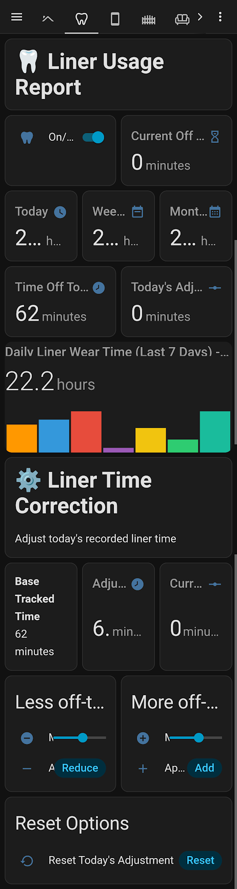

# Wear Time Tracker for Home Assistant

I'm really bad at remembering things. Especially when it's not a habit yet. This home assistant gadget helped me build good habits around wearing my clear liner braces for the required 22 hours a day. 

This could be used for anything you need to track over time. 
You can add or remove time if you forget to track. I suggest adding an NFC tag to control the input boolean, as I found that to be the most reliable method.

I used a combination of telegram and TTS messages to remind myself when i had them off for too long. For the TTS messages it works best if you pair it with BLE based speaker selection so that it reminds you via the nearest speaker. 
This has been really helpful to me over the past year, and I felt like it would be a waste to simply delete it without sharing. I don't have a lot of experience making packages for home assistant.  I'm sure there's a better way of wrapping this, (and indeed many of the things you find here could be better) but hopefully this helps someone in this form. 

If you need help feel free to reach out to me. I'm dcslv on reddit. 


<p align="center">
  
</p>

## Functions

- **On/off toggle** to log when you remove/replace the device
- **Session timer** showing how long the device has been out
- **Timed reminders** at 40, 50, and 60 minutes of continuous removal (push notification + TTS)
- **Daily limit alert** when total off-time exceeds 2 hours
- **Compliance tracking** with daily percentage, weekly/monthly scores, and streak counter
- **Time correction** controls to adjust the recorded time if you forgot to toggle
- **7-day bar chart** of adjusted daily wear hours
- **Nightly migration** that preserves manual corrections in permanent storage so historical scores stay accurate

## Requirements

- Home Assistant 2024.1 or later
- Recorder history retention of at least 30 days (for monthly compliance; 7 days minimum for weekly)
- A notification service (Companion App, Telegram, Pushover, etc.)
- A TTS service and speaker (optional, for spoken reminders)
- [mini-graph-card](https://github.com/kalkih/mini-graph-card) via HACS (optional, for the dashboard bar chart)

## Installation

### 1. Configure your variables

Open `variables.env` and fill in your own Home Assistant entities:

| Variable | What it does | Examples |
|---|---|---|
| `NOTIFY_SERVICE` | The service called to send push notifications when a time threshold is reached. This should be whatever you normally use to get alerts on your phone. | `notify.mobile_app_james_phone`, `notify.notify`, `notify.pushover` |
| `TTS_SERVICE` | The text-to-speech service for spoken reminders. Only used when you're home. Pick whichever TTS engine you have configured. | `tts.google_translate_say`, `tts.cloud_say`, `tts.piper` |
| `DEFAULT_SPEAKER` | The media_player entity where TTS announcements play. This is your "default" speaker for reminders. See [Room-Aware TTS](#room-aware-tts-optional) below if you want location-based routing. | `media_player.living_room_speaker`, `media_player.kitchen_display` |
| `PRESENCE_SENSOR` | A binary sensor (or person entity) that is `on`/`home` when you're physically at home. TTS only plays when this is on - push notifications always fire regardless. If you don't have one, point it at any entity that stays `on`. | `person.james`, `binary_sensor.anyone_home` |
| `DEVICE_NAME` | A display name used in notification text and dashboard headers. Does not affect entity IDs. Pick whatever you're actually tracking. | `aligners`, `retainers`, `liners`, `trays`, `guard` |

### 2. Run the install script

```bash
chmod +x install.sh
./install.sh
```

This reads your `variables.env`, substitutes the values into the template files, and writes the results to `output/`.

### 3. Deploy to Home Assistant

**Enable packages** in your `configuration.yaml` (if not already):

```yaml
homeassistant:
  packages: !include_dir_named packages
```

**Copy the package:**

```bash
cp output/wear_time_tracker.yaml /path/to/your/ha-config/packages/
```

**Add the dashboard:** Open a Lovelace dashboard in raw YAML editor mode and paste the contents of `output/dashboard.yaml` into a view's `cards:` list.

**Restart Home Assistant** to load the new entities.

### 4. Verify

After restart, check that these entities exist in Developer Tools > States:

- `input_boolean.liners_on`
- `sensor.liners_current_session_time`
- `sensor.liners_daily_total_off_time`
- `sensor.liners_daily_compliance_percentage`

The history_stats sensors will show `unknown` until they accumulate data (give it a day).

## How it works

### Daily flow

1. Toggle `input_boolean.liners_on` to **off** when you remove the device
2. The tracker records the removal time and starts a live session timer
3. At 40, 50, and 60 minutes you get escalating notifications
4. Toggle back to **on** when you replace the device
5. The session duration is added to the daily running total
6. If total off-time exceeds 2 hours, you get a daily limit alert

### Time corrections

Sometimes you forget to toggle, or toggle late. The dashboard has reduce/add controls:

- **Reduce off-time**: If you toggled off late (the device was actually out for less time than recorded), reduce by the difference
- **Add off-time**: If you forgot to toggle at all and want to add off-time retroactively

Corrections are stored as a daily adjustment that modifies the displayed total without altering the underlying history_stats data. At midnight, the adjustment is migrated to permanent storage so that yesterday's (and older) compliance scores remain accurate.

### Compliance scoring

- **Daily**: Percentage of the 2-hour daily allowance remaining
- **Weekly**: Percentage of the last 7 days where total off-time stayed under 2 hours
- **Monthly**: Same calculation over sampled days spanning 30 days
- **Streak**: Consecutive days (up to 7) meeting the daily limit

### Tunable limits

The default limits are hardcoded for a 2-hour daily maximum with a 30-minute session warning. To change them, edit these values in `wear_time_tracker.yaml` after install:

| Limit | Where | Default |
|---|---|---|
| Session warning threshold | `sensor.liners_compliance_status` template | 30 minutes |
| Daily limit | `sensor.liners_compliance_status` and compliance % templates | 120 minutes (2 hours) |
| Reminder thresholds | Automation trigger `above:` values | 39, 49, 59 minutes |

## Notification service notes

The package uses a generic notification format with `title` and `message` fields, which works with most `notify.*` services out of the box.

**Telegram users**: If you set `NOTIFY_SERVICE=telegram_bot.send_message`, you'll need to manually add `target` and `parse_mode` fields to each notification action in the output file:

```yaml
- action: telegram_bot.send_message
  data:
    target: "YOUR_CHAT_ID"
    parse_mode: html
    title: "..."   # optional for telegram
    message: "..."
```

## Room-aware TTS (optional)

By default, all TTS reminders play on a single speaker. If you have room-level presence detection - for example via [Bermuda BLE](https://github.com/agittins/bermuda), [ESPresense](https://espresense.com/), or phone-based area tracking - you can route TTS to whichever room you're in.

Replace the `__DEFAULT_SPEAKER__` entity in each automation's TTS block with a Jinja template that picks a speaker based on your area sensor:

```yaml
# Replace the static entity_id with a dynamic lookup:
- variables:
    target_speaker: >
      
      
      {{ speakers.get(area, 'media_player.living_room_speaker') }}
- action: media_player.volume_set
  target:
    entity_id: "{{ target_speaker }}"
  data:
    volume_level: 0.5
- action: tts.your_tts_service
  data:
    entity_id: "{{ target_speaker }}"
    message: "Your aligners have been out for forty minutes"
```

This pattern maps room names from your area sensor to speaker entities, with a fallback default. You'll need to customize the room names and speaker entities to match your setup.

## File structure

```
wear_time_tracker/
  README.md              This file
  variables.env          Your configuration (edit this)
  install.sh             Substitution script (run this)
  wear_time_tracker.yaml Template: HA package (all entities, automations, scripts)
  dashboard.yaml         Template: Lovelace dashboard cards
  output/                Generated files after running install.sh
```

## Uninstalling

1. Delete `packages/wear_time_tracker.yaml` from your HA config
2. Remove the dashboard cards
3. Restart Home Assistant
4. Clean up orphaned entities in Settings > Devices & Services > Entities (filter by "liners")
